# Cloud sync with Supabase

LaxPocket is local-first: every athlete's data lives in a JSON file on the phone and the app works offline. Cloud sync is optional. When it's set up and you're signed in, each athlete is backed up to a Supabase project called **LaxPocket** and kept in sync across phones.

## Set up the LaxPocket project

1. **Create the project.** In the [Supabase dashboard](https://supabase.com/dashboard), choose **New project**, name it `LaxPocket`, and pick a region near you (for Ontario, *Canada (Central)*). Save the database password somewhere safe.
2. **Create the tables.** Either:
   - open **SQL Editor** and run each file in [`supabase/migrations`](../supabase/migrations) in order (the file names start with the date). Copy a file exactly with `pbcopy < supabase/migrations/<file>.sql`, then paste it into a new query with ⌘V and press **Run**; selecting the text by hand can drop a line. Or
   - with the [Supabase CLI](https://supabase.com/docs/guides/cli): `supabase link --project-ref <your-project-ref>` then `supabase db push`.
3. **Check sign-in settings.** Under **Authentication → Sign In / Providers**, keep **Email** on. With *Confirm email* on (the default), a new account has to open the link in its email before it can sign in. Under **Authentication → URL Configuration → Redirect URLs**, add `laxpocket://auth-callback`: opened on the iPhone, the link then confirms the email, opens LaxPocket and signs in. Without it, Supabase sends the link to the *Site URL* instead (`http://localhost:3000` on a new project), which shows an error page on a phone even though the email did get confirmed.
4. **Connect the app.** `LaxPocket/Resources/Supabase.plist` holds the **Project URL** and the **anon** (or *publishable*) key; this repository's copy already points at the LaxPocket project. For a different project, replace both values (they're under the project's **Connect** button, or in **Project Settings → API Keys**); [`supabase/Supabase.example.plist`](../supabase/Supabase.example.plist) is a blank template. Then run `xcodegen generate` and build.
5. **Sign in on the phone.** In the app: **Theme & settings → Cloud sync → Create an account**, then open the link in the confirmation email on the same iPhone (or tap **Resend confirmation email** if it expired). LaxPocket opens signed in. Every athlete on the phone uploads. On a second phone, sign in with the same account and the athletes come down.

**Updating an existing project.** When a new file appears in `supabase/migrations`, run it (or `supabase db push`) before installing the app build that needs it. Until then that build's sync stops with an error naming the missing table or column, and data stays safe on the phone. The height and weight tracker needs [`20260930000000_body_measurements.sql`](../supabase/migrations/20260930000000_body_measurements.sql), wall ball needs [`20261002000000_wallball.sql`](../supabase/migrations/20261002000000_wallball.sql), budgets by season and program need [`20261003000000_program_budgets.sql`](../supabase/migrations/20261003000000_program_budgets.sql) (it turns each athlete's single budget into the budget for the season they're set to), tournament trips need [`20261004000000_tournament_trips.sql`](../supabase/migrations/20261004000000_tournament_trips.sql), expenses paid in US dollars need [`20261005000000_expense_currency.sql`](../supabase/migrations/20261005000000_expense_currency.sql), athletes without an NDTP team need [`20261006000000_optional_ndtp_group.sql`](../supabase/migrations/20261006000000_optional_ndtp_group.sql), family accounts (invite codes, the athlete's own login, locked mental docs) need [`20261007000000_family_accounts.sql`](../supabase/migrations/20261007000000_family_accounts.sql), coaches' rosters need [`20261008000000_coach_rosters.sql`](../supabase/migrations/20261008000000_coach_rosters.sql), and coaches' tasks and game notes need [`20261009000000_coach_tasks.sql`](../supabase/migrations/20261009000000_coach_tasks.sql). All three are safe to run again if a first attempt stopped partway. Builds from before it can't read an athlete with no NDTP group, so update every phone that syncs one. Builds from before tournament trips can't read the new expense categories (tournament fees, hotel, food, other), so update every phone that syncs an athlete once one of them records a trip.

The anon key is designed to ship inside apps. It only lets a client talk to the API; row-level security decides what each signed-in account can read or write. Never put the `service_role` key in the app.

Once your own accounts exist, you can turn off **Allow new users to sign up** in the Auth settings so nobody else can create one.

## Schema

The migrations are in [`supabase/migrations`](../supabase/migrations): [`20260927000000_laxpocket_schema.sql`](../supabase/migrations/20260927000000_laxpocket_schema.sql) creates everything, [`20260930000000_body_measurements.sql`](../supabase/migrations/20260930000000_body_measurements.sql) adds height and weight, [`20261002000000_wallball.sql`](../supabase/migrations/20261002000000_wallball.sql) adds wall ball, [`20261003000000_program_budgets.sql`](../supabase/migrations/20261003000000_program_budgets.sql) adds budgets by season and program, [`20261004000000_tournament_trips.sql`](../supabase/migrations/20261004000000_tournament_trips.sql) adds tournament trips, [`20261005000000_expense_currency.sql`](../supabase/migrations/20261005000000_expense_currency.sql) adds expenses paid in US dollars and the exchange rate, [`20261006000000_optional_ndtp_group.sql`](../supabase/migrations/20261006000000_optional_ndtp_group.sql) makes the NDTP group optional, [`20261007000000_family_accounts.sql`](../supabase/migrations/20261007000000_family_accounts.sql) adds accounts, relationships, invites and locked mental docs, [`20261008000000_coach_rosters.sql`](../supabase/migrations/20261008000000_coach_rosters.sql) adds coaches' rosters, [`20261009000000_coach_tasks.sql`](../supabase/migrations/20261009000000_coach_tasks.sql) adds coaches' tasks and game notes, [`20261010000000_sport_profiles.sql`](../supabase/migrations/20261010000000_sport_profiles.sql) adds a sport to each athlete profile and roster (hockey alongside lacrosse; see [multi-sport.md](multi-sport.md)), and [`20261011000000_hockey_practice.sql`](../supabase/migrations/20261011000000_hockey_practice.sql) adds hockey's shooting, stickhandling and passing practice, weekly goals, and shots and stickhandling coach tasks. Each table maps one-to-one to a model in `Core/Sources/LaxPocketCore` and to a row type in `Core/Sources/LaxPocketCore/Cloud/CloudRows.swift`.

```mermaid
erDiagram
    auth_users ||--o| accounts : "is"
    auth_users ||--o{ profile_members : "has access via"
    profiles ||--o{ profile_members : "shared with"
    profiles ||--o{ profile_invites : "invites to"
    auth_users ||--o{ rosters : "coaches"
    rosters ||--o{ roster_athletes : ""
    profiles ||--o{ roster_athletes : "on"
    profiles ||--o{ mental_coach_trust : ""
    rosters ||--o{ assignments : "tasks"
    assignments ||--o{ assignment_completions : "ticked off"
    season_events ||--o{ event_coach_notes : "coach notes"
    profiles ||--o{ programs : ""
    profiles ||--o{ training_sessions : ""
    programs ||--o{ training_sessions : "logged with"
    profiles ||--o{ combine_results : ""
    combine_results ||--o{ combine_measurements : ""
    profiles ||--o{ season_events : ""
    season_events ||--o| game_stats : ""
    season_events ||--o| game_reflections : ""
    season_events ||--o{ event_focus_goals : ""
    season_events ||--o{ event_videos : ""
    season_events ||--o{ event_checklist_items : ""
    profiles ||--o{ expenses : ""
    programs ||--o{ expenses : "for"
    profiles ||--o{ season_budgets : ""
    programs ||--o{ program_budgets : "one per season"
    profiles ||--o{ trips : ""
    season_events ||--o{ trips : "to"
    trips ||--o{ expenses : "cost"
    profiles ||--o{ mental_docs : ""
    profiles ||--o{ body_measurements : ""
    profiles ||--o{ wallball_drills : ""
    profiles ||--o{ wallball_sessions : ""
    wallball_sessions ||--o{ wallball_sets : ""
    profiles ||--o{ practice_drills : ""
    profiles ||--o{ practice_sessions : ""
    practice_sessions ||--o{ practice_sets : ""
```

| Table | One row per | Key columns |
|---|---|---|
| `profiles` | athlete in one sport | `id` (same UUID as on the phone), name, class year, positions, `benchmark_group` (NDTP age group; null when not on an NDTP team), weekly goal, season label, theme, `body_units` (`imperial` / `metric`), `usd_to_cad` (Canadian dollars per US dollar, 0.5–3, default 1.38), `sport` (`lacrosse` / `hockey`), `athlete_id` (the athlete's first profile, for a profile added for another sport; null on the first), and for hockey `shoots` (`left` / `right`), `plays_goal`, `level` (e.g. `U15 AA`), `weekly_shot_goal` (0–100,000, default 1,000; 0 for none) and `weekly_stickhandling_goal` (minutes, 0–10,080, default 60). `sport` and `athlete_id` are set when the profile is made and never change. `season_budget` is only kept for older builds; budgets live in `season_budgets` |
| `accounts` | signed-in account | `user_id`, `display_name` (what others on an athlete see), `kind` (`parent` / `athlete` / `coach` / `mentalCoach`). Set up once after signing in |
| `profile_members` | account with access to an athlete | `profile_id`, `user_id`, `role`: `owner` / `editor` / `viewer`, `relationships`: one or more of `parent` / `athlete` / `coach` / `mentalCoach` (members from before family accounts are parents) |
| `profile_invites` | invite code | `code` (8 characters, no I, O, 0 or 1), `profile_id`, `relationship`, `created_by`, `expires_at` (a week), `accepted_by` / `accepted_at`. Kept after use: an accepted athlete invite records the parent's consent to the athlete's own account |
| `programs` | team, coach, facility… | primary key (`profile_id`, `id`); group; which session type it counts toward; `first_season` / `last_season` it runs (either can be null: open-ended) |
| `training_sessions` | logged session | `started_at`, `category`, `minutes`, `effort` (RPE 1–10), `focus` (text array), `notes`; foreign key to its program |
| `combine_results` | testing day | `tested_at`, `event_name`, height and weight as typed |
| `combine_measurements` | result on a testing day | primary key (`result_id`, `metric`); `value` in N, inches or seconds |
| `season_events` | game, tournament, showcase or camp | `kind`, `team`, `opponent`, `starts_at` / `ends_at`, `date_is_tentative`, `our_score` / `their_score` (both or neither) |
| `game_stats` | event with a stat line | goals, assists, shots, ground balls, draw controls, caused turnovers |
| `game_reflections` | event with a reflection | self-rating 1–10, went well, work on, coach feedback and when it was added |
| `event_focus_goals` | pre-game goal | `position`, `goal`, `outcome` (`pending` / `hit` / `partly` / `missed`), `note` |
| `event_videos` | video link | `position`, `title`, `url`, `duration_text` |
| `event_checklist_items` | prep checklist item | `position`, `title`, `done` |
| `expenses` | expense | `spent_at`, `title`, `category`, `amount` (profile currency, CAD by default), `note`, `program_id` (optional; deleting the program clears it), `season` (null on older rows: the season of `spent_at`), `trip_id` (optional; deleting the trip clears it), `currency` (`CAD` / `USD`) and `original_amount` (what was paid in US dollars; null for CAD). `amount` is always CAD and is what budgets add up |
| `trips` | tournament, showcase or camp trip | `name`, `destination`, `country` (`US` / `CA` / `other`), `departs_at` / `returns_at`, `season`, `program_id` and `event_id` (optional; deleting either clears it), `budget`, `travel_mode` (`drive` / `fly` / `bus` / `train` / `other`), `travel_details`, hotel name, address, confirmation number and check-in / check-out (null: the trip's dates), `note`. Days in the US are worked out by the app from the dates and country |
| `season_budgets` | season with a budget | primary key (`profile_id`, `season`); `amount`, `note` |
| `program_budgets` | program's budget for one season | primary key (`profile_id`, `program_id`, `season`); `amount`, `note`. A program running several seasons has a row per season |
| `body_measurements` | height and weight check | `measured_at`, `height_cm` (0.1 cm, 50–250), `weight_kg` (0.01 kg, 10–250), `note`. Either value can be null, not both. Always metric; `profiles.body_units` only sets how the app shows them |
| `wallball_drills` | drill the athlete added or changed | primary key (`profile_id`, `id`); `name`, `hands` (`each`: right and left counted separately, `together`: one count), `default_reps` (1–500), `hidden`. The built-in routine lives in the app, so only the athlete's own drills and edited built-ins are stored |
| `wallball_sessions` | day's wall ball, or a timed challenge | `done_at`, `minutes`, `challenge_seconds` (5–3600, set for a challenge), `notes` |
| `wallball_sets` | reps of one drill with one hand | primary key (`session_id`, `drill_id`, `hand`); `hand` (`right` / `left` / `both`), `reps` (1–5000), `position`. `drill_id` has no foreign key because it can name a built-in drill |
| `practice_drills` | hockey practice drill the athlete added or changed | primary key (`profile_id`, `id`); `kind` (`shooting` / `stickhandling` / `passing` / `other`), `name`, `measure` (`shots` / `minutes` / `reps`), `tracks_target` (shots only), `default_amount` (1–500), `hidden`. The built-in drills live in the app |
| `practice_sessions` | day's hockey practice, or a timed challenge | `done_at`, `minutes`, `challenge_seconds` (5–3600, set for a challenge), `notes` |
| `practice_sets` | one drill in a practice session | primary key (`session_id`, `drill_id`); `amount` (1–5000: shots, minutes or reps by the drill's measure; in a challenge, the count reached in the time), `on_target` (shots on target, 0 to `amount`, or null when not counted), `position`. `drill_id` has no foreign key because it can name a built-in drill |
| `mental_docs` | linked Drive document | `url`, `folder`, `kind`, `status`, when and by whom the document was last updated, `visibility` (`shared` / `locked` / `hidden`) and `locked_by` (set by the database). The file itself stays in Google Drive |

| `rosters` | coach's team (`kind` `team`) or mental coach's clients (`mental`) | `coach_id`, `name`, `sport` (only athletes' profiles for that sport can join), `join_code` (null: closed to new athletes). Made, renamed and given new codes through `create_roster`, `rename_roster` and `reset_roster_code` |
| `roster_athletes` | athlete on a roster | primary key (`roster_id`, `profile_id`); `added_by` (the parent who entered the code) |
| `assignments` | coach's task | `roster_id`, `profile_id` (null: everyone on the roster, including later joiners), `kind` (`wallball` for lacrosse or `shots` for hockey, with `target_reps`; `stickhandling` for hockey or `training`, with `target_minutes`, and an optional `category` for training; or `check` to tick off; wall ball, shots and stickhandling have to suit the roster's sport), `schedule` (`once` by `due_on`, `daily`, or `weekly` Monday to Sunday, from `starts_on` until an optional `ends_on`), `title`, `notes` |
| `assignment_completions` | task ticked off by hand for one period | primary key (`assignment_id`, `profile_id`, `period_start`): the day (daily), the week's Monday (weekly) or `starts_on` (once). `done_by` is who ticked it |
| `event_coach_notes` | coach's note on a game | primary key (`event_id`, `coach_id`), `profile_id`, `note`. Separate from `game_reflections`, so a family's offline edit to the event can't overwrite it |
| `mental_coach_trust` | mental coach the athlete's login lets open what it locked | primary key (`profile_id`, `athlete_id`, `coach_id`). Changed only through `set_mental_coach_trust` |

Views go with them: `my_profile_access` (the signed-in account's role and relationships for each athlete), `locked_mental_docs` (locked docs as everyone else sees them: id, folder and date, no title, link or note) `roster_athlete_profiles` (the athletes on the signed-in coach's rosters: name, class year, positions, NDTP group, weekly goal, theme, sport and hockey details, nothing about the budget), `athlete_assignments` (each task once per athlete it's for, with the roster and coach names) and `athlete_coach_notes` (game notes with the coach's name).

Design choices:

- **Seasons are stored as the year they start**: `2026` is the 2026/27 season, which starts in August. An expense's season defaults to the season of its date but can be set, since a fee paid in July is often for the season starting in August.

- **Everything hangs off `profiles`.** Deleting an athlete deletes all of their rows (`on delete cascade`).
- **IDs come from the phone.** Rows are created offline, so the app assigns UUIDs (program IDs are short strings, unique per athlete) and the database accepts them. Upserts are safe to repeat.
- **Children carry `profile_id` too**, with a composite foreign key to their parent (`(event_id, profile_id)` → `season_events (id, profile_id)`). Access rules are the same simple check on every table, and a row can't be attached to someone else's event while claiming to be yours.
- **Enum-like columns are `text` with a `check`** listing the app's values (`'u15Women'`, `'teamFees'`, `'toReview'`…). They match the Swift enums' raw values, so no mapping is needed, and adding a value is a one-line migration.
- **Checks keep the data sensible:** effort 1–10, minutes 1–1440, both scores or neither, events can't end before they start, doc and video links must be `http(s)`, heights and weights in centimetre and kilogram ranges.
- Every table has `created_at` and `updated_at` (kept current by a trigger). `profiles.created_by` records who made the athlete and never changes.

### Who can see what

Row-level security is on for every table, and nothing is visible without signing in.

- Whoever creates an athlete becomes its **owner**: their parent, or the athlete if their account is set up as an athlete.
- Each account on an athlete has **relationships** that decide which sections it sees, and a **role** that decides whether it can change them:

  | Section | Tables | Parent | Athlete | Coach | Mental coach |
  |---|---|---|---|---|---|
  | training | `programs`, `training_sessions` (except mental ones), `combine_*`, `wallball_*`, `practice_*` | change | change | read | read |
  | events | `season_events` and everything under an event | change | change | read | read |
  | health | `body_measurements` | change | change | — | — |
  | budget | `expenses`, `trips`, `season_budgets`, `program_budgets` | change | read | — | — |
  | mental | `mental_docs`, mental sessions (`training_sessions` with category `mental`) | change | change | — | read |

  Changing needs the `owner` or `editor` role as well; viewers only read. The owner reads and changes every section.
- Only the owner can delete the athlete, invite people or remove them. Anyone else can leave.
- **Invites.** `create_profile_invite(profile_id, relationship)` (owner only) makes a code; `accept_profile_invite(code)` links the signed-in account with that relationship (parents and athletes as editors, coaches as viewers). A code works once, expires after a week, and an athlete can have only one linked login. Relationships change only through invites, never by editing `profile_members` directly. In the app: **Cloud sync → People on …** and **Join with a code**.
- **Coaches' rosters.** A coach makes a roster; a parent enters its code with `join_roster(code, profile_id)` (only the owner or a parent can), which is their consent. The coach then reads that athlete as a coach (team roster) or mental coach (mental roster), from the table above, without being in `profile_members`, and reads the athlete's profile only through `roster_athlete_profiles`. Taking the athlete off the roster, by the coach or a parent, ends it. `describe_code(code)` says what a code is for (an invite or a roster) before it's used, and `athlete_coaches(profile_id)` lists an athlete's coaches for the family.
- **Tasks and game notes.** Only a roster's coach gives tasks on it, to the whole roster or one athlete on it, and only a mental coach sets mental minutes (a team coach can't see mental sessions). Families read tasks through `athlete_assignments`; the athlete or a parent (anyone who can change the training section) ticks one off in `assignment_completions`, and the coach reads that. A coach writes `event_coach_notes` only for athletes they coach; families read them through `athlete_coach_notes`. An athlete taken off a roster loses its tasks; notes already written stay.
- `share_profile(profile_id, email, role)` still gives another account access by email, as a parent, on every sport of the athlete the owner owns. The other person has to have created their account first.
- **Sports.** An athlete who plays several sports has one profile per sport, sharing an `athlete_id`. Only the owner of the athlete's profiles can add a sport, and an athlete has one profile per sport. The family is the same on every sport: `add_family_to_sport(profile_id)` (owner only, called by the app after a new sport's first upload) brings every parent and the athlete's login from the athlete's other sports, never coaches; a parent or athlete invite accepted on one sport covers them all; and `remove_from_athlete(profile_id, user_id)` takes a parent or the athlete's login off every sport (anyone else only off that profile), whether the owner removes them or they leave. Coaches belong to one sport: `join_roster` only takes the athlete's profile for the roster's sport, so a coach never sees the athlete's other sports.
- **Locked mental docs.** Only the athlete's own login can lock or hide a doc, and a locked or hidden doc is readable only by the account that locked it (`locked_by`). Others on the athlete see a locked doc through `locked_mental_docs`; a hidden one not at all. Because it's tied to that one account, unlinking the athlete and linking someone else as "the athlete" doesn't open it. The athlete's login can let a mental coach open the docs it locked (`set_mental_coach_trust`); nobody else can grant that, and hidden docs stay the athlete's alone.
- A lock is enforced by row-level security on the API. Whoever runs the Supabase project can still read every row in the dashboard, and anyone the file is shared with in Google Drive can still open it.

The access checks are `security definer` functions in a `private` schema, which the API doesn't expose.

## How sync works

Code: `Core/Sources/LaxPocketCore/Cloud/` (no third-party packages; it talks to Supabase's REST APIs directly).

For each athlete on the phone, a sync:

1. reads the athlete's rows from the cloud (paged, so it isn't capped by the API's row limit),
2. does a **three-way merge** against what the cloud held after the last sync on this phone (kept in `Application Support/LaxPocket/sync/<id>.json`),
3. writes only what changed on this phone: parents before children, deletes last.

Merge rules, per row:

- changed on one side only → that side wins;
- changed on both sides → **this phone wins**;
- deleted on one side and edited on the other → **the edit wins**, so nothing someone typed is lost.

What the account can do with the athlete comes down with every sync (`my_profile_access`) and limits the merge: sections it can't read are removed from the phone, sections it can only read take the cloud's copy (an edit made there anyway is replaced, not sent), and a mental doc the athlete locked or hid leaves the phones of everyone else, even if they'd edited it. An athlete whose owner takes this account off them stops syncing, and **Cloud sync** offers to remove them from the phone.

Coaches' tasks and notes come down with every sync and are never sent back (only coaches change them). Ticks merge like any other table; a tick for a task the athlete no longer has is left alone rather than sent. Whether a wall ball or training task is done is worked out on each phone from what's logged, so it isn't stored.

An event syncs as one unit together with its stats, reflection, goals, videos and checklist, and so do a testing day with its results and a wall ball session with its sets. The writes aren't a single transaction, but they can safely be repeated: if a sync stops halfway, the next one sees what already arrived and sends the rest.

The app syncs a few seconds after each change, when it comes to the foreground, and from **Sync now**. Deleting an athlete on a phone only removes it from that phone. The cloud copy is listed under *In the cloud, not on this iPhone*, where it can be downloaded again or deleted for everyone.

Timestamps are compared to the millisecond, the precision that survives a round trip through Postgres. Money is rounded to cents, hours and heights to one decimal and weights to two before upload, so a value read back from the database equals the one that was sent.

## Testing

- **Schema and access rules:** `supabase/tests/run-local.sh` applies the migration to a throwaway database on a local Postgres and runs [`supabase/tests/rls_test.sql`](../supabase/tests/rls_test.sql). It checks that each account sees only its own athletes, that viewers can't write, that sharing and invites work, what each relationship can read and change, that only the athlete can lock a doc and nobody else can read it, and that cascades and constraints behave.
- **Sync end to end:** `supabase/tests/start-postgrest.sh` starts PostgREST (the API Supabase uses) in front of that schema and prints tokens for two test accounts. `CloudSyncIntegrationTests` then syncs one athlete between two "phones" through it, including conflicting edits, deletes, sharing and paging.
- CI runs both on every push, in the *Supabase schema & sync* job.
