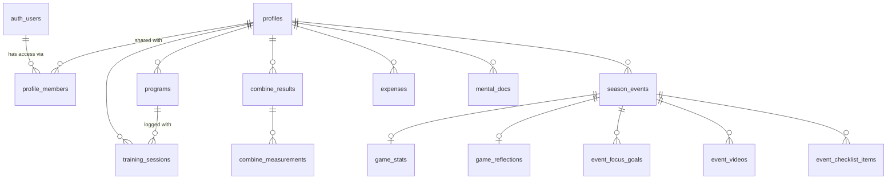

# Cloud sync with Supabase

LaxPocket is local-first: every athlete's data lives in a JSON file on the phone and the app works offline. Cloud sync is optional. When it's set up and you're signed in, each athlete is backed up to a Supabase project called **LaxPocket** and kept in sync across phones.

## Set up the LaxPocket project

1. **Create the project.** In the [Supabase dashboard](https://supabase.com/dashboard), choose **New project**, name it `LaxPocket`, and pick a region near you (for Ontario, *Canada (Central)*). Save the database password somewhere safe.
2. **Create the tables.** Either:
   - open **SQL Editor**, paste the contents of [`supabase/migrations/20260927000000_laxpocket_schema.sql`](../supabase/migrations/20260927000000_laxpocket_schema.sql) and run it, or
   - with the [Supabase CLI](https://supabase.com/docs/guides/cli): `supabase link --project-ref <your-project-ref>` then `supabase db push`.
3. **Check sign-in settings.** Under **Authentication → Sign In / Providers**, keep **Email** on. With *Confirm email* on (the default), a new account has to click the link in its email before it can sign in.
4. **Connect the app.** `LaxPocket/Resources/Supabase.plist` holds the **Project URL** and the **anon** (or *publishable*) key; this repository's copy already points at the LaxPocket project. For a different project, replace both values (they're under the project's **Connect** button, or in **Project Settings → API Keys**); [`supabase/Supabase.example.plist`](../supabase/Supabase.example.plist) is a blank template. Then run `xcodegen generate` and build.
5. **Sign in on the phone.** In the app: **Theme & settings → Cloud sync → Create an account**, confirm the email, then **Sign in**. Every athlete on the phone uploads. On a second phone, sign in with the same account and the athletes come down.

The anon key is designed to ship inside apps. It only lets a client talk to the API; row-level security decides what each signed-in account can read or write. Never put the `service_role` key in the app.

Once your own accounts exist, you can turn off **Allow new users to sign up** in the Auth settings so nobody else can create one.

## Schema

The migration is [`supabase/migrations/20260927000000_laxpocket_schema.sql`](../supabase/migrations/20260927000000_laxpocket_schema.sql). Each table maps one-to-one to a model in `Core/Sources/LaxPocketCore` and to a row type in `Core/Sources/LaxPocketCore/Cloud/CloudRows.swift`.

| Table | One row per | Key columns |
|---|---|---|
| `profiles` | athlete | `id` (same UUID as on the phone), name, class year, positions, NDTP group, weekly goal, season label, budget, theme |
| `profile_members` | account with access to an athlete | `profile_id`, `user_id`, `role`: `owner` / `editor` / `viewer` |
| `programs` | team, coach, facility… | primary key (`profile_id`, `id`); group; which session type it counts toward |
| `training_sessions` | logged session | `started_at`, `category`, `minutes`, `effort` (RPE 1–10), `focus` (text array), `notes`; foreign key to its program |
| `combine_results` | testing day | `tested_at`, `event_name`, height and weight as typed |
| `combine_measurements` | result on a testing day | primary key (`result_id`, `metric`); `value` in N, inches or seconds |
| `season_events` | game, tournament, showcase or camp | `kind`, `team`, `opponent`, `starts_at` / `ends_at`, `date_is_tentative`, `our_score` / `their_score` (both or neither) |
| `game_stats` | event with a stat line | goals, assists, shots, ground balls, draw controls, caused turnovers |
| `game_reflections` | event with a reflection | self-rating 1–10, went well, work on, coach feedback and when it was added |
| `event_focus_goals` | pre-game goal | `position`, `goal`, `outcome` (`pending` / `hit` / `partly` / `missed`), `note` |
| `event_videos` | video link | `position`, `title`, `url`, `duration_text` |
| `event_checklist_items` | prep checklist item | `position`, `title`, `done` |
| `expenses` | expense | `spent_at`, `title`, `category`, `amount` (profile currency, CAD by default), `note` |
| `mental_docs` | linked Drive document | `url`, `folder`, `kind`, `status`, when and by whom the document was last updated. The file itself stays in Google Drive |

Design choices:

- **Everything hangs off `profiles`.** Deleting an athlete deletes all of their rows (`on delete cascade`).
- **IDs come from the phone.** Rows are created offline, so the app assigns UUIDs (program IDs are short strings, unique per athlete) and the database accepts them. Upserts are safe to repeat.
- **Children carry `profile_id` too**, with a composite foreign key to their parent (`(event_id, profile_id)` → `season_events (id, profile_id)`). Access rules are the same simple check on every table, and a row can't be attached to someone else's event while claiming to be yours.
- **Enum-like columns are `text` with a `check`** listing the app's values (`'u15Women'`, `'teamFees'`, `'toReview'`…). They match the Swift enums' raw values, so no mapping is needed, and adding a value is a one-line migration.
- **Checks keep the data sensible:** effort 1–10, minutes 1–1440, both scores or neither, events can't end before they start, doc and video links must be `http(s)`.
- Every table has `created_at` and `updated_at` (kept current by a trigger). `profiles.created_by` records who made the athlete and never changes.

### Who can see what

Row-level security is on for every table, and nothing is visible without signing in.

- Whoever creates an athlete becomes its **owner**.
- **Owners and editors** can add, change and delete the athlete's data. **Viewers** can only read it.
- Only the owner can delete the athlete or change who has access.
- `share_profile(profile_id, email, role)` lets the owner give another account `editor` or `viewer` access, e.g. a parent's phone or a coach. The other person has to have created their account first. In the app: **Cloud sync → Share … with another account**.

The access checks are `security definer` functions in a `private` schema, which the API doesn't expose.

## How sync works

Code: `Core/Sources/LaxPocketCore/Cloud/` (no third-party packages; it talks to Supabase's REST APIs directly).

For each athlete on the phone, a sync:

1. reads the athlete's rows from the cloud (paged, so it isn't capped by the API's row limit),
2. does a **three-way merge** against what the cloud held after the last sync on this phone (kept in `Application Support/LaxPocket/sync/<id>.json`),
3. writes only what changed on this phone: parents before children, deletes last.

Merge rules, per row:

- changed on one side only → that side wins;
- changed on both sides → **this phone wins**;
- deleted on one side and edited on the other → **the edit wins**, so nothing someone typed is lost.

An event syncs as one unit together with its stats, reflection, goals, videos and checklist, and so does a testing day with its results. The writes aren't a single transaction, but they can safely be repeated: if a sync stops halfway, the next one sees what already arrived and sends the rest.

The app syncs a few seconds after each change, when it comes to the foreground, and from **Sync now**. Deleting an athlete on a phone only removes it from that phone. The cloud copy is listed under *In the cloud, not on this iPhone*, where it can be downloaded again or deleted for everyone.

Timestamps are compared to the millisecond, the precision that survives a round trip through Postgres. Money is rounded to cents and hours to one decimal before upload, so a value read back from the database equals the one that was sent.

## Testing

- **Schema and access rules:** `supabase/tests/run-local.sh` applies the migration to a throwaway database on a local Postgres and runs [`supabase/tests/rls_test.sql`](../supabase/tests/rls_test.sql). It checks that each account sees only its own athletes, that viewers can't write, that sharing works, and that cascades and constraints behave.
- **Sync end to end:** `supabase/tests/start-postgrest.sh` starts PostgREST (the API Supabase uses) in front of that schema and prints tokens for two test accounts. `CloudSyncIntegrationTests` then syncs one athlete between two "phones" through it, including conflicting edits, deletes, sharing and paging.
- CI runs both on every push, in the *Supabase schema & sync* job.
